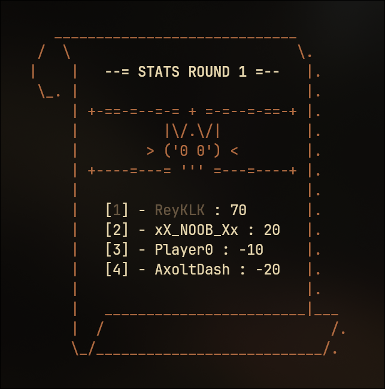

<h1 align="center">SkullKing-Counter</h1>

> My first Rust project. This program helps calculate and track player scores in the game Skull King, providing a complete table of all scores.

---

## Overview

SkullKing-Counter is a command-line tool written in Rust to help you keep track of scores when playing the game Skull King. It automates score calculations and maintains a table with all players' scores across rounds, making gameplay smoother and more enjoyable.

---

## Features

- Fast and accurate score calculation for Skull King
- Keeps a detailed table of all players' scores
- Easy to use from the command line
- Written entirely in Rust
- Lots of colored ASCII art!

---

## Screenshots

<!-- Add your images/screenshots here -->
<p align="center">
  <table>
    <tr>
      <td></td>
      <td></td>
    </tr>
    <tr>
      <td></td>
      <td></td>
    </tr>
  </table>
</p>

---

## Getting Started

### Prerequisites

- Rust (latest stable version recommended)
- Cargo (comes with Rust)
- A terminal or command prompt
- Basic knowledge of command-line operations

### Installation

Clone the repository:
```bash
git clone https://github.com/AxoltDash/SkullKing-Counter.git
cd SkullKing-Counter
```

Build the project:
```bash
cargo build --release
```

### Usage

Run the program:
```bash
cargo run
```

Follow the on-screen instructions to add players, enter rounds, and view the score table.

---

## Contributing

Pull requests are welcome! If you have suggestions for improvement, please open an issue or submit a PR.
The code isn't perfect, and I am still learning Rust and this is my first project to experiment with the language. If you find any bugs or have suggestions for improvements, please let me know!

---

## License

This project is licensed under the MIT License.

---
